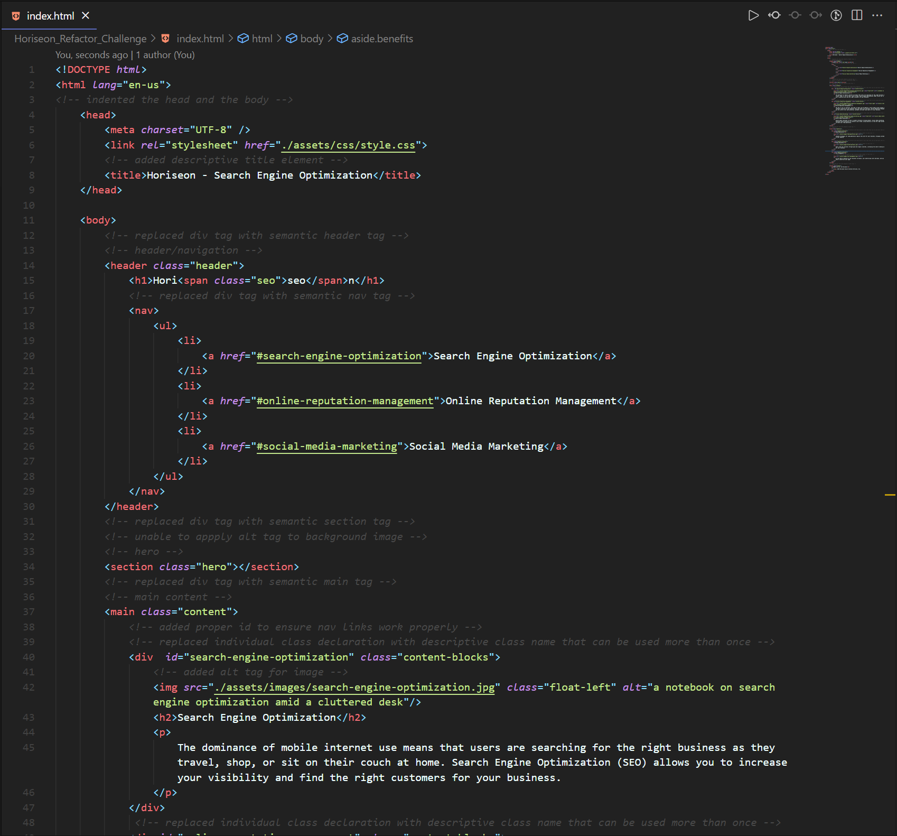
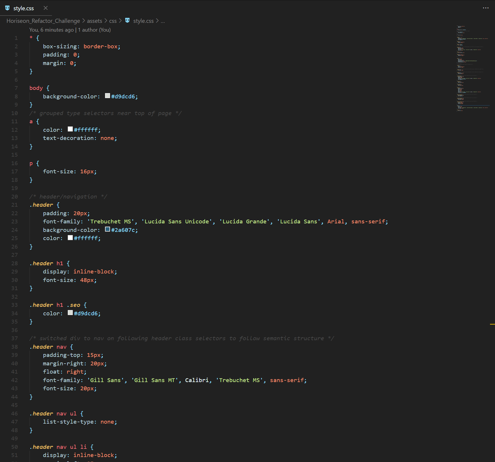

# Horiseon Refactor Challenge
## The code for the Horiseon website has been refactored to follow accessibility standards optimizing it for search engines. All of the Acceptance Criteria and Grading Requirements have been met.
 

> Refactor: **HTML**

  

### The deployed application can be viewed [here](https://bdunham484.github.io/Horiseon_Refactor_Challenge/) .
 

> Refactor: **CSS**

